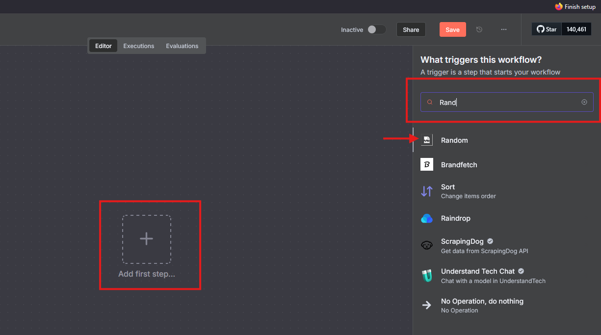
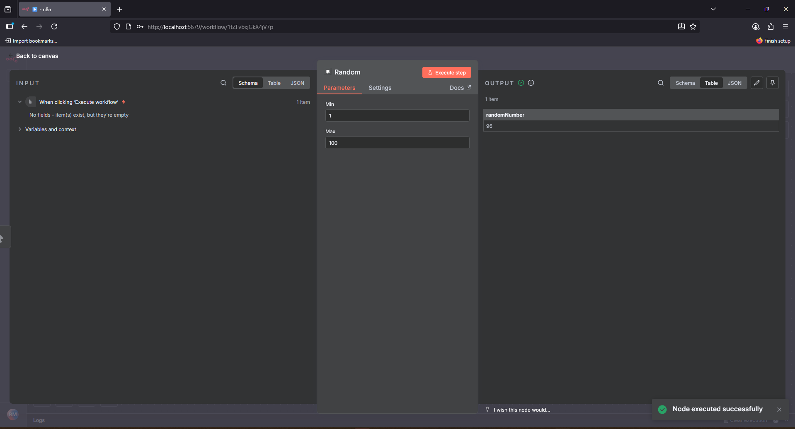

# n8n custom node

This repository provides a custom node for [n8n](https://n8n.io/).

> n8n is a workflow automation platform that gives technical teams the flexibility of code with the speed of no-code. With 400+ integrations, native AI capabilities, and a fair-code license, n8n lets you build powerful automations while maintaining full control over your data and deployments.
>
> [n8n - Secure Workflow Automation for Technical Teams](https://github.com/n8n-io/n8n)

The node named `Random` uses the public [Random.org](https://www.random.org/) API to generate true random numbers within a range defined by the user.

## What the node does

Generates random numbers based on a numeric minimum (`Min`) and maximum (`Max`) input.

## Requirements

To run the project correctly, make sure you have installed:

* [Node.js](https://nodejs.org/en/) (LTS version, e.g. 22.x)
* [npm](https://www.npmjs.com/) (usually bundled with Node.js)
* [Rancher Desktop](https://rancherdesktop.io/) or [Docker](https://www.docker.com/products/docker-desktop/) + [Docker Compose](https://docs.docker.com/compose/install/)

## How to run

### 1. Install Dependencies

Go into the node folder and install the packages required to compile TypeScript:

```bash
cd n8n-nodes-random
npm install
```

Then compile the code:

```bash
npm run build
```

This will create the `dist` folder with the JavaScript files ready to be used by n8n.

### 2. Start the n8n Environment with Docker

The included `docker-compose.yml` is already configured to start an instance of n8n along with a PostgreSQL database, and mounts the custom node folder.

To start, run:

```bash
docker-compose up -d
```

n8n will be accessible at [http://localhost:5679](http://localhost:5679) after a few seconds.

### 3. Testing the Node in n8n

1. Open the n8n interface at [http://localhost:5679](http://localhost:5679).  
2. Create a new workflow.  
3. Click `+` to add a node.  
4. Search for "Random".  
5. The custom node will appear with its icon. Add it to the workflow.  
6. Fill in the "Min" and "Max" values and execute to check the result.

Step-by-step screenshot:



Execution result:



## References

- [n8n installed with Docker in a local self-hosted stable version (@latest = 1.85.4)](https://docs.n8n.io/hosting/installation/docker/)  
- [Creating a custom node](https://docs.n8n.io/integrations/creating-nodes/build/programmatic-style-node/)  
- [Install and run the custom node locally](https://docs.n8n.io/integrations/creating-nodes/build/programmatic-style-node/)  
